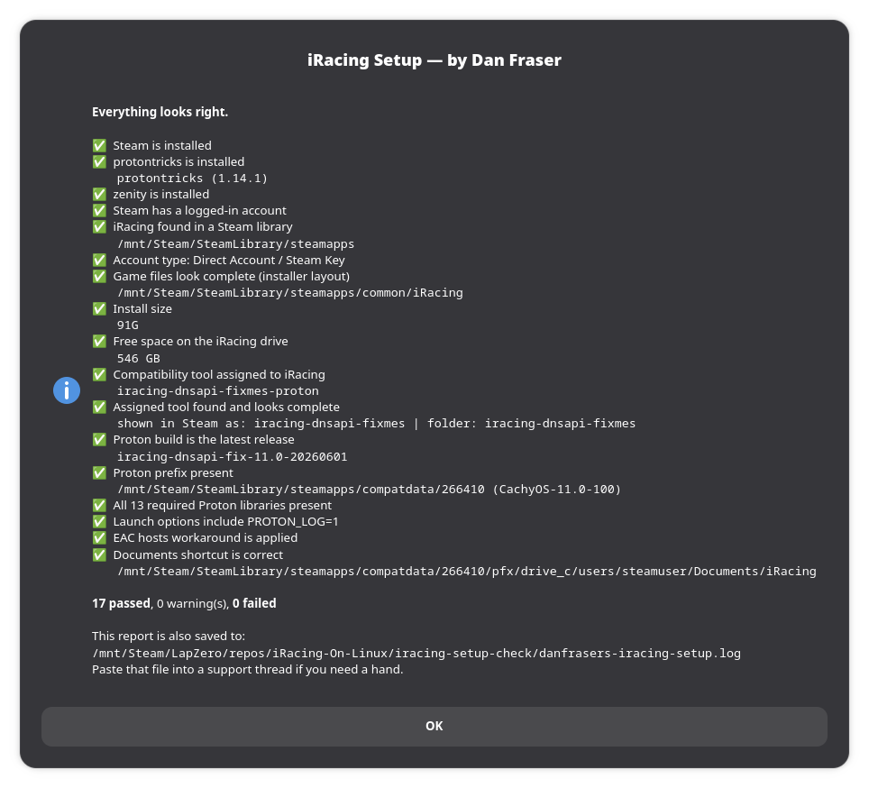

# iRacing On Linux

A collaborative effort to record and document as much information as possible about
running iRacing on Linux: peripherals, accompanying software, distributions and more.

## Game status: kind of inoperative

iRacing's anticheat does not currently support Linux, so **online racing does not work**.
Test Drive, Replays, Time Attack and AI Racing can be accessed, at your own risk.

Nothing here gets you past anticheat, and nothing here is a workaround for it. The goal
is to demonstrate that everything else about iRacing runs properly on Linux, and to make
the case to iRacing that Linux support is worth enabling.

## Setup script

A guided setup that gets Steam, protontricks, iRacing and a custom Proton build into a
working state. It runs in a window, not a terminal, and explains each step as it goes.

**[Download the latest version](https://github.com/DanFraserUK/iRacing-On-Linux/releases/latest/download/iracing_setup_simple_gui.sh)**

Then run it from wherever it downloaded to, usually your Downloads folder:

```bash
cd ~/Downloads
bash iracing_setup_simple_gui.sh
```

`bash <script>` works whether or not the file is marked executable, so that's the form
used throughout. If you'd rather double-click it in your file manager, or run it as
`./iracing_setup_simple_gui.sh`, mark it executable first:

```bash
chmod +x iracing_setup_simple_gui.sh
```

Some file managers still refuse to run scripts on a double-click regardless, so if
nothing happens, use the terminal command above.

### Already set up and something isn't right?

Run it with `--test` first. It checks everything and changes nothing:

```bash
bash iracing_setup_simple_gui.sh --test
```

You get a report of what's right and what isn't, saved to
`danfrasers-iracing-setup.log` next to the script. **Paste that log into your support
thread** rather than describing the problem. It's read-only, so it's always safe to run.



Note: your paths may be different to the image above.

### Options

| Option | What it does |
| --- | --- |
| `--test` | Report on an existing install. Changes nothing. |
| `--dryrun` | Walk the whole setup without installing, downloading or writing anything. |
| `--help` | List the options. |

## Compatibility

| | |
| --- | --- |
| **Tested on** | CachyOS (Arch), KDE Wayland |
| **Supported** | Arch, CachyOS, EndeavourOS, Manjaro, Debian, Ubuntu, Fedora, Nobara |
| **Needs** | Steam, zenity, curl, tar, protontricks (the script installs what it can) |
| **Won't work with** | Flatpak Steam, Snap Steam, immutable distributions |

"Tested" means it gets run there regularly. "Supported" means the code paths exist but
see far less real-world use, so if something breaks on Debian or Fedora, please open an
issue with your `--test` log attached. That's the only way those paths improve.

The script detects Flatpak and Snap Steam and stops rather than half-working. If that's
what you have, install Steam from your distribution's repositories instead.

## Account types

iRacing on Steam comes in two forms, and they install completely differently:

- **Steam Purchase** — Steam downloads the whole game. Everything happens in Steam.
- **Direct Account / Steam Key** — Steam installs a small stub, and the real game files
  come from iRacing's own Windows installer, run under Proton.

The script works out which one you have and follows the right path. If you have a direct
iRacing account and redeemed a Steam key, you're the second kind.

## What's in this repository

| Path | Contents |
| --- | --- |
| `iracing-setup-check/` | The setup script, plus a manual walkthrough of the same steps |
| `OS Specific Instructions/` | Per-distribution notes |
| `One Reason To Use Linux/` | Background on why any of this matters |
| `Letter to iRacing/` | The case for official Linux support |
| `create-iracing-shortcuts.sh` | Desktop shortcuts for iRacing |

If you'd rather do it by hand, `iracing-setup-check/Manual Method.md` covers the same
ground step by step.

## Contributing

Documentation for a distribution must be specific to that distribution, even where the
upstream is shared. Clean Arch, Manjaro and EndeavourOS are all Arch based, but their
install processes differ enough that combining them helps nobody.

Bug reports are most useful with a `--test` log attached.
