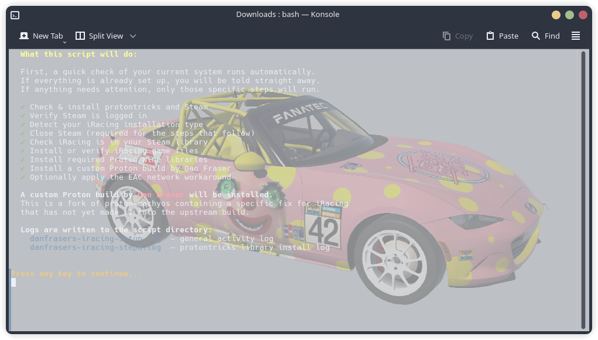
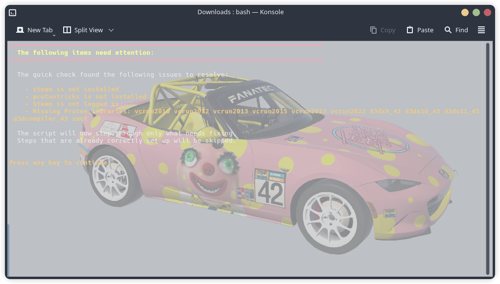
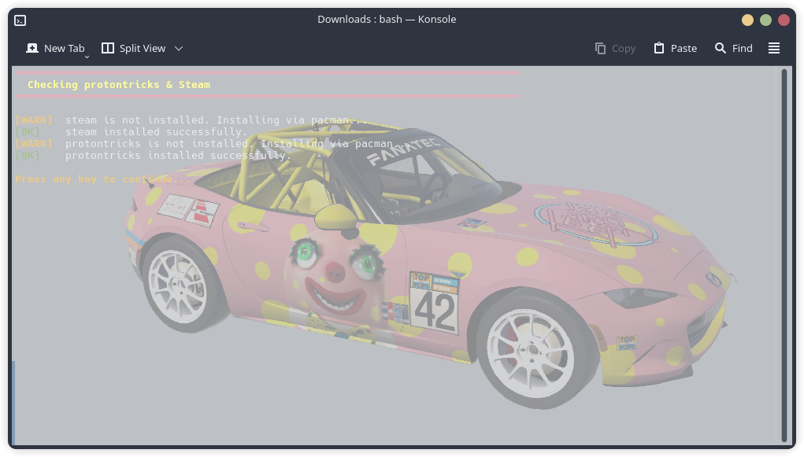
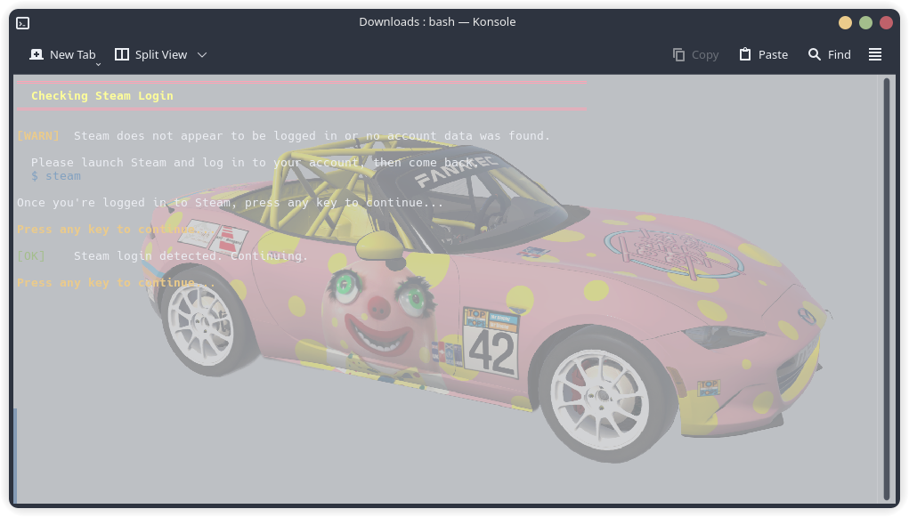
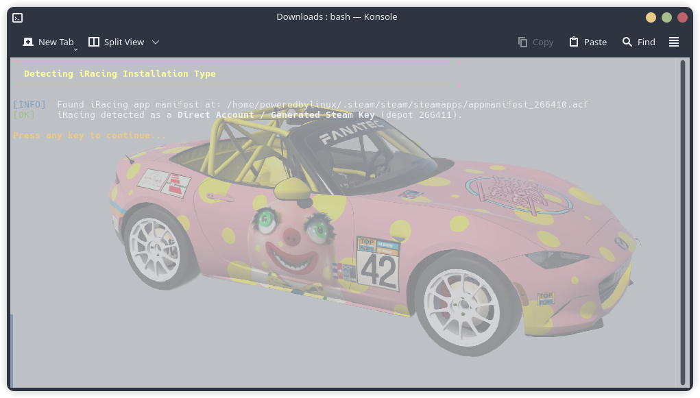
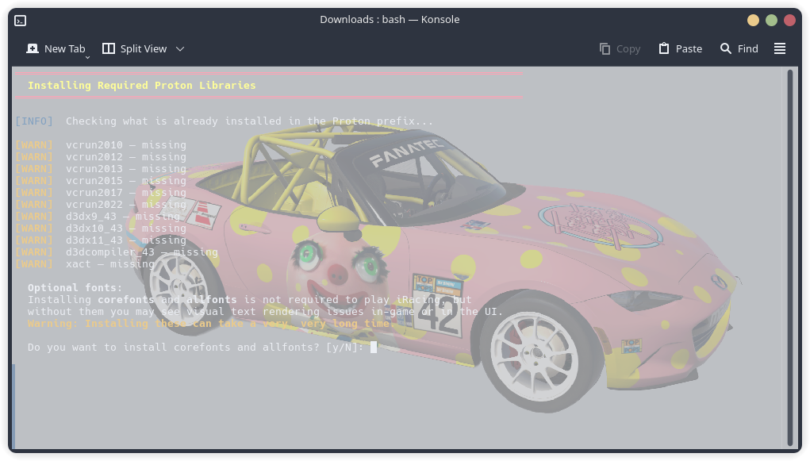
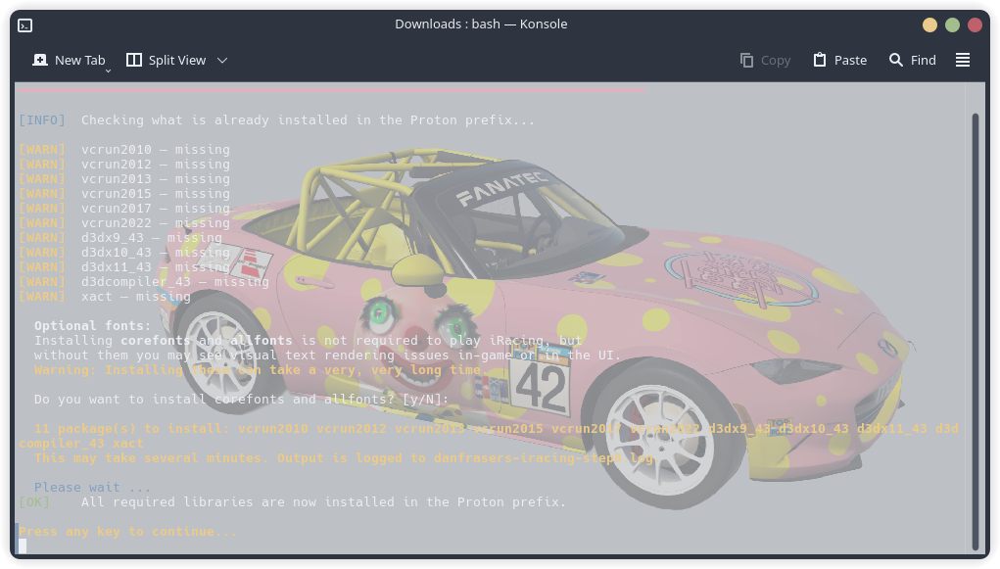
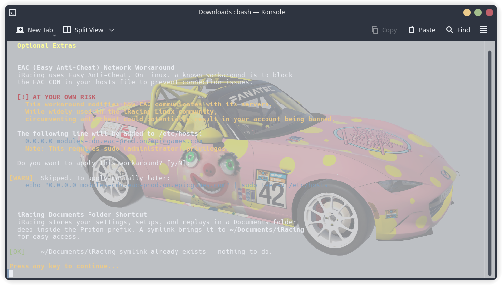
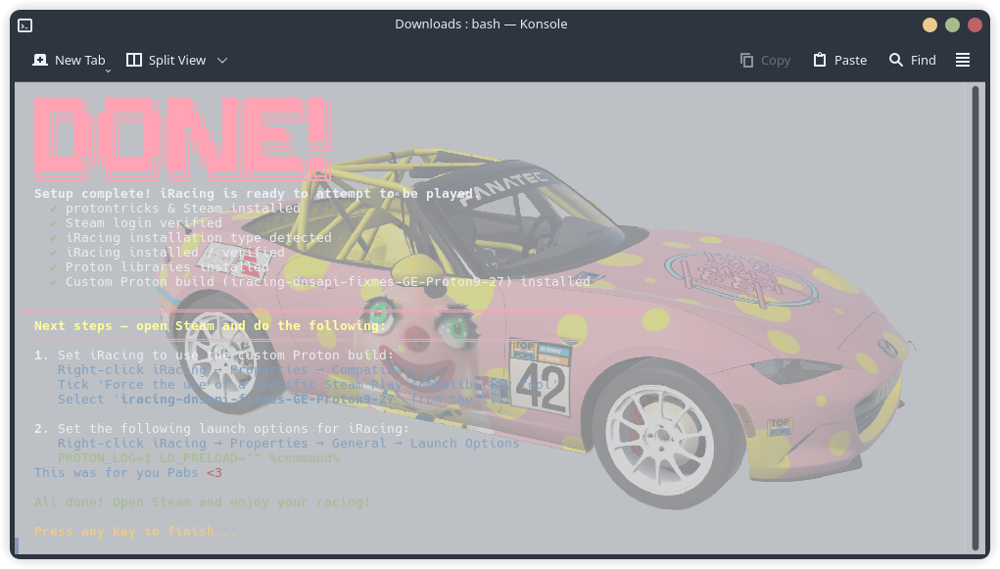

# iRacing Setup Check

This directory contains screenshots of the iRacing setup check program on Linux.

Only supports Arch based distros for the time being.  Support for Debian/Fedora types soon.

## Usage

To use this, download the <a href="https://raw.githubusercontent.com/DanFraserUK/iRacing-On-Linux/main/iracing-setup-check/iracing_setup_check.tar.xz" download>iracing_setup_check.tar.xz</a> and extract it. It can be run from anywhere.

Open a terminal at its location and run:

```
$ chmod +x ./iracing_setup_check.sh
$ ./iracing_setup_check.sh
```

Follow the prompts.

## Screenshots





















